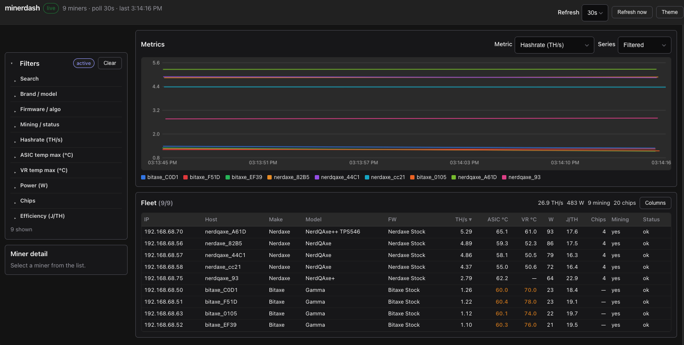

# hasherdash

Read-only fleet dashboard for ASIC miners. Go + [oat.ink](https://oat.ink/) UI, powered by [asic-rs-go](https://github.com/adamdecaf/asic-rs-go).

Compact table, filters, miner detail, and live charts for a wall monitor (20+ miners). Metric history is stored in **SQLite** so charts survive restarts.



## Quick start (Docker)

The image builds `asic-rs-go` from the public Go module proxy — no separate checkout.

**Docker Compose (recommended):**

```bash
# optional: MINER_SUBNET=192.168.1.0/24 docker compose up -d --build
docker compose up -d --build
```

SQLite is bind-mounted to the host at **`./data/hasherdash.db`** (`./data` → `/app/data` in the container). Create the directory first if needed:

```bash
mkdir -p data
```

Open http://localhost:8080

**Plain `docker run`:**

```bash
make docker
mkdir -p data

docker run --rm --network host \
  -e MINER_SUBNET=192.168.1.0/24 \
  -e SQLITE_PATH=/app/data/hasherdash.db \
  -v "$PWD/data:/app/data" \
  hasherdash:latest
```

**With a config file:**

```bash
cp hasherdash.example.yaml hasherdash.yaml
# edit subnets, then:

docker run --rm --network host \
  -v "$PWD/hasherdash.yaml:/app/hasherdash.yaml:ro" \
  -v "$PWD/data:/app/data" \
  -e CONFIG_FILE=/app/hasherdash.yaml \
  -e SQLITE_PATH=/app/data/hasherdash.db \
  hasherdash:latest
```

`--network host` lets the container scan your LAN. Always mount a host directory on `/app/data` (and keep `SQLITE_PATH` under that path) so metric history survives restarts and is easy to back up.

Subnets are re-scanned every `rescan_interval` (default 30m). Discovered miners stay in the fleet until `miner_ttl` (default 7d) after last successful poll, and are re-polled every `poll_interval` (default 30s).

## Local run (no Docker)

Needs a built [asic-rs-go](https://github.com/adamdecaf/asic-rs-go) FFI (sibling checkout is simplest):

```bash
# optional: clone next to this repo if you don't already have it
# git clone https://github.com/adamdecaf/asic-rs-go ../asic-rs-go

make ffi   # builds FFI in ../asic-rs-go (override with ASIC_RS_GO=…)

export MINER_SUBNET=192.168.1.0/24
# or: cp hasherdash.example.yaml hasherdash.yaml  # edit subnets

make run
```

By default metrics are written to `./hasherdash.db` in the working directory.

## Metric storage (SQLite)

Successful polls append samples (hashrate, temps, power, efficiency, chips, …) to a SQLite database. Charts and `/api/history` read from that DB.

| Setting | Default | Notes |
|---------|---------|--------|
| `sqlite_path` / `SQLITE_PATH` | `hasherdash.db` (Docker: `/app/data/hasherdash.db`) | File path; parent dirs are created as needed |
| `history_retention` / `HISTORY_RETENTION` | `168h` | Samples older than this are deleted after each poll |
| `sqlite_path: off` / `SQLITE_PATH=off` | — | In-memory ring buffers only (lost on restart) |

**Docker data mount:** bind a host directory to `/app/data` and leave `SQLITE_PATH=/app/data/hasherdash.db`. With Compose this is `./data` → host file `./data/hasherdash.db`.

The image entrypoint runs briefly as root to `chown` the bind-mounted data dir to uid `10001`, then drops privileges. Rebuild the image after pulling so that entrypoint is present (`docker compose up -d --build`).

If you still hit permission errors on an old image:

```bash
mkdir -p data && sudo chown -R 10001:10001 data
```

Fleet snapshots (live table/detail) stay in memory and are refreshed by the poller. Only **time series** are durable.

## Configuration

**Precedence:** defaults → config file → environment (env wins).

### Config file

Auto-loaded from cwd: `hasherdash.yaml`, `hasherdash.yml`, `config.yaml`, `config.yml`, `hasherdash.json`, `config.json`.

Or set: `-config /path` / `CONFIG_FILE=/path`.

```yaml
http_addr: ":8080"
poll_interval: 30s
rescan_interval: 30m
miner_ttl: 168h
history_retention: 168h
sqlite_path: hasherdash.db
subnets:
  - 192.168.1.0/24
# ips:
#   - 192.168.1.10
```

Full template: `hasherdash.example.yaml`.

### Environment

| Env | Default | Description |
|-----|---------|-------------|
| `MINER_SUBNET` / `MINER_SUBNETS` | — | CIDR(s), comma-separated; re-scanned on `RESCAN_INTERVAL` |
| `MINER_IPS` | — | Comma-separated IPs to poll |
| `MINER_RANGES` | — | asic-rs range strings (e.g. `192.168.1.1-50`) |
| `CONFIG_FILE` | auto | Path to YAML/JSON config |
| `HTTP_ADDR` | `:8080` | Listen address |
| `POLL_INTERVAL` | `30s` | Backend poll interval for known miners |
| `RESCAN_INTERVAL` | `30m` | Full subnet/range discovery cadence (`0` = startup only) |
| `MINER_TTL` | `168h` | Keep offline miners this long after last success (`0` = forever) |
| `HISTORY_RETENTION` | `168h` | How long metric samples are kept for charts |
| `SQLITE_PATH` | `hasherdash.db` | SQLite file for metrics (`off` = memory only) |
| `HISTORY_POINTS` | auto | Optional in-memory ring size when SQLite is off |
| `SCAN_TIMEOUT_SEC` | `8` | Per-miner identify timeout |
| `SCAN_CONCURRENT` | `200` | Discovery concurrency |

UI refresh interval is separate (top-right control, `localStorage`). Chart range defaults to **1d** with options for 4h / 12h / 1d / 3d / 7d / custom.

## API

| Method | Path | Description |
|--------|------|-------------|
| GET | `/api/health` | Liveness |
| GET | `/api/meta` | Fleet status + filter facets |
| GET | `/api/miners` | Compact snapshots |
| GET | `/api/miners/{ip}` | Detail (boards, fans, pools) |
| GET | `/api/history?metric=hashrate&ids=a,b&window=1d` | Time series (`window`, or `since`/`until` RFC3339) |
| POST | `/api/rescan` | Kick a full subnet/range discovery + poll now |

Metrics: `hashrate`, `temp`, `asic_temp`, `vr_temp`, `wattage`, `efficiency`, `chips`.

## Project layout

```
cmd/hasherdash/     entrypoint
internal/          api, config, poller, store (SQLite metrics)
web/static/        oat.ink UI
docs/              GitHub Pages site
Dockerfile         multi-stage (module proxy + Rust FFI + cgo)
```

## Notes

- **Read-only** — no restart / pool / power control in the UI.
- Canvas charts (no Chart.js); styling via [oat](https://github.com/knadh/oat).
- Metric history uses pure-Go SQLite ([modernc.org/sqlite](https://pkg.go.dev/modernc.org/sqlite)); no extra system library.
- Docker builds pull `github.com/adamdecaf/asic-rs-go` and compile the FFI inside the image.
- CI builds the binary and Docker image on every push/PR.
